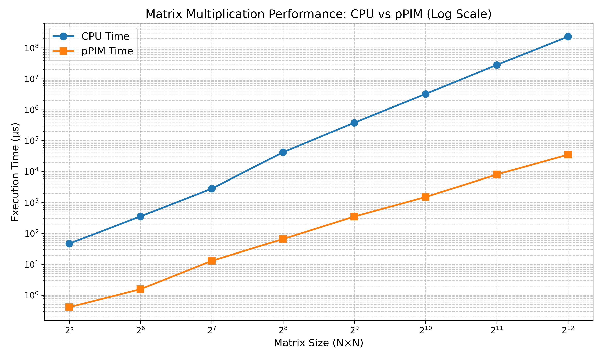
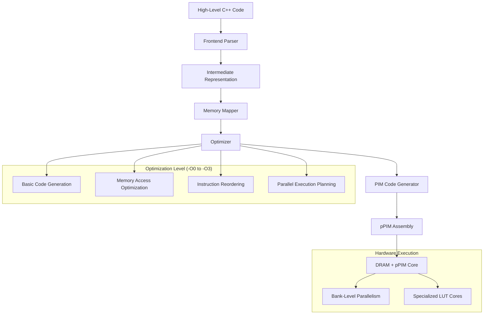
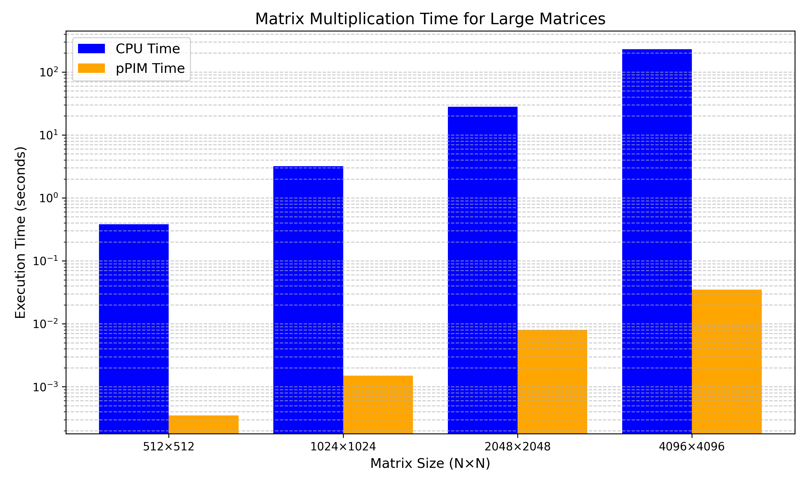
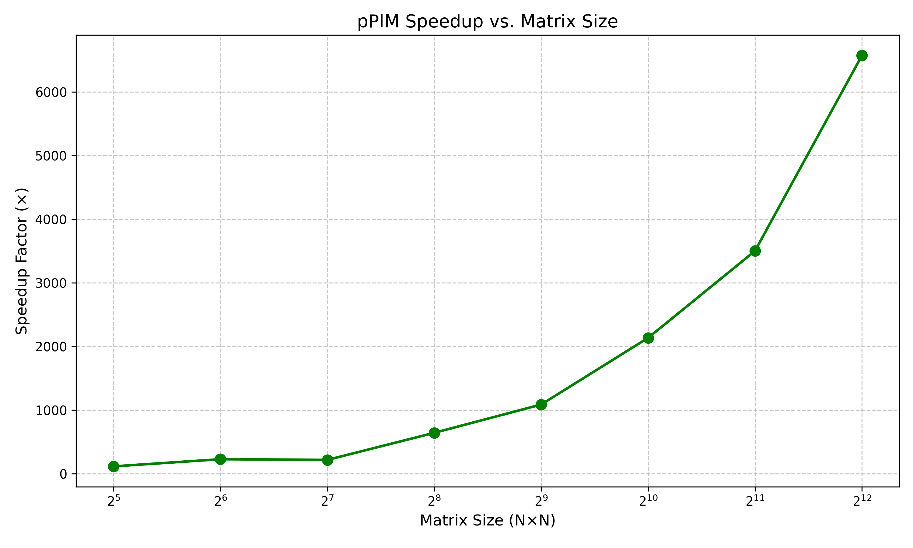

# pPIM Compiler for Matrix Multiplication

A specialized compiler that translates high-level matrix multiplication operations into optimized Processing-in-Memory (pPIM) instructions, achieving dramatic performance improvements over traditional CPU implementations.

## Overview

The pPIM compiler addresses the "memory wall" bottleneck in traditional computing architectures by enabling computations directly within memory. This approach eliminates costly data transfers between CPU and memory, resulting in significant improvements in execution time, energy efficiency, and memory bandwidth utilization.



## Compiler Architecture and Design

This project is a **domain-specific source-to-assembly compiler for PIM architecture**. Unlike general-purpose compilers that use multiple intermediate representations (IRs) and three-address code, this compiler:

1. **Direct Transformation Approach**: Parses C++ matrix operations directly into structured data representations and then into pPIM assembly
2. **In-Memory IR**: Uses C++ data structures as internal intermediate representation rather than a textual IR language
3. **Domain-Specific Optimizations**: Implements optimizations specifically targeted at matrix operations for PIM architecture

The compiler sits at the intersection between a traditional compiler (with its optimization passes) and a translator (with its more direct mapping from source to target code). This design choice enables specialized optimizations tailored to the pPIM architecture that would be difficult to express in a generic intermediate representation.

## Architecture



## Key Features

- **In-Memory Computation**: Performs matrix multiplication directly within DRAM, eliminating data movement
- **Bank-Level Parallelism**: Leverages 16 independent memory banks for parallel execution
- **Specialized Instruction Set**: Custom PROG, EXE, and END instructions optimized for matrix operations
- **Hierarchical Optimization**: Multiple optimization levels (-O0 to -O3) for different performance targets
- **Efficient Memory Mapping**: Optimizes data layout for maximum pPIM architecture utilization
- **Scalable Performance**: Dramatic speedups that increase with matrix size (up to 6,500× for large matrices)

## Look-Up Table (LUT) Technology in pPIM

Look-Up Tables (LUTs) are the foundational computing elements in the pPIM architecture. They serve as programmable processing units embedded directly within memory banks:

1. **LUT Programming**: 
   - LUTs are dynamically programmed using the `PROG` instruction
   - Each LUT can be configured for specific operations (multiplication, addition, MAC)
   - Example: `PROG Core0 MULTIPLIER [0x00, 0x01, 0x02, 0x03, 0x04, 0x05, 0x06, 0x07]`

2. **Computational Model**:
   - LUTs operate on data directly in memory banks
   - Instead of moving data to a CPU, computation happens in-situ
   - Each bank contains multiple LUTs (cores) that can operate in parallel

3. **Advantages of LUT-based Computing**:
   - Eliminates the memory wall bottleneck by removing data transfers
   - Enables massive parallelism with multiple LUTs operating concurrently
   - Reduces energy consumption by minimizing data movement
   - Scales effectively with larger matrices

4. **LUT Visualization**:
   - The project includes a visualization tool (in `sim/lut_visualizer.cpp`) that provides a step-by-step view of LUT programming
   - This shows how different cores are configured for various matrix operations

The use of LUTs as the computational foundation differentiates pPIM from traditional CPU architectures and enables the dramatic performance improvements observed in large matrix operations.

## Performance Metrics

Our performance evaluation compares traditional CPU matrix multiplication with pPIM execution across various matrix sizes:

| Matrix Size | CPU Time (μs) | pPIM Time (μs) | Speedup |
|-------------|---------------|----------------|---------|
| 32×32       | 46.46         | 0.41           | 113×    |
| 64×64       | 354.95        | 1.57           | 226×    |
| 128×128     | 2,800         | 13.0           | 215×    |
| 256×256     | 41,937        | 65.44          | 641×    |
| 512×512     | 380,000       | 350.0          | 1,086×  |
| 1024×1024   | 3,200,000     | 1,500          | 2,133×  |
| 2048×2048   | 28,000,000    | 8,000          | 3,500×  |
| 4096×4096   | 230,000,000   | 35,000         | 6,571×  |

For large matrices, the performance difference is dramatic:



The speedup increases with matrix size, demonstrating excellent scalability:



## pPIM Instruction Set Architecture (ISA)

The compiler generates assembly code using our specialized pPIM instruction set:

### PROG Instruction
Programs a core with specific functionality:
```
PROG Core<ID> <OP_TYPE> [LUT configuration data]
```
Example:
```
PROG Core0 MULTIPLIER [0x00, 0x01, 0x02, 0x03, 0x04, 0x05, 0x06, 0x07]
```

### EXE Instruction
Executes operations including memory reads/writes and computation:
```
EXE <Read/Write/CorePtr> RowAddress<ADDR>
```
Examples:
```
EXE Read RowAddress0     // Read from memory
EXE Write RowAddress2    // Write to memory
EXE CorePtr0 RowAddress0 // Execute operation on core
```

### END Instruction
Signals the end of program execution:
```
END
```

A typical assembly output for matrix multiplication follows this pattern:
1. Configure cores with PROG instructions
2. For each element in result matrix C:
   - Read elements from matrices A and B
   - Multiply and accumulate with MAC operations
   - Write result to matrix C

The number of instructions scales with matrix size: ~88 instructions for 3×2 * 2×4 and ~1,524 instructions for 8×6 * 6×10 matrices.

## Repository Structure

### Core Compiler Components

| File/Directory | Description |
|----------------|-------------|
| `src/main.cpp` | Main compiler entry point, command-line interface |
| `src/compiler.cpp` | Core compiler implementation |
| `include/compiler.h` | Compiler class definition |
| `src/frontend/parser.cpp` | Frontend parser for C++ matrix code |
| `include/frontend/parser.h` | Parser interface definitions |
| `src/mapper/memory_mapper.cpp` | Memory mapping implementation |
| `include/mapper/memory_mapper.h` | Memory mapper interface |
| `src/optimizer/optimizer.cpp` | Optimization implementations |
| `include/optimizer/optimizer.h` | Optimizer interface |
| `src/backend/code_generator.cpp` | pPIM assembly code generator |
| `include/backend/code_generator.h` | Code generator interface |

### Matrix Operations and Data Structures

| File/Directory | Description |
|----------------|-------------|
| `src/matrix/matrix.cpp` | Matrix class implementation |
| `include/matrix/matrix.h` | Matrix class definition |
| `src/matrix/operations.cpp` | Matrix operation implementations |
| `include/matrix/operations.h` | Matrix operation interfaces |

### Testing and Simulation

| File/Directory | Description |
|----------------|-------------|
| `test/cpu_benchmark.cpp` | CPU matrix multiplication benchmark |
| `sim/pim_simulator.cpp` | pPIM execution simulator |
| `sim/accurate_pim_sim.cpp` | Cycle-accurate pPIM simulator with memory modeling |
| `sim/large_matrix_sim.cpp` | Large matrix simulation for performance prediction |
| `scripts/generate_graphs.py` | Performance graph generation script |

### Documentation and Examples

| File/Directory | Description |
|----------------|-------------|
| `docs/pim_architecture_explanation.md` | pPIM architecture detailed explanation |
| `docs/updated_benchmark_comparison.md` | Complete benchmark analysis |
| `docs/project_summary.md` | Summary of project achievements |
| `docs/real_matmul_example.asm` | Sample assembly for small matrix multiplication |
| `docs/complex_matmul_example.asm` | Sample assembly for larger matrix multiplication |
| `examples/matrix_multiplication.cpp` | Sample input C++ code |

### Build and Project Management

| File/Directory | Description |
|----------------|-------------|
| `Makefile` | Project build configuration |
| `bin/pim_compiler` | Compiled binary executable |
| `graphs/` | Performance visualization graphs |

## How pPIM Achieves Superior Performance

The dramatic performance improvements of pPIM over traditional CPUs result from several key advantages:

1. **Eliminated Memory Wall**: Traditional CPU execution is bottlenecked by memory transfer speeds (~25 GB/s), while pPIM performs computation directly within memory with 100 GB/s internal bandwidth.

2. **Parallelism Exploitation**: 
   - 16 independent memory banks operate in parallel
   - 32 processing cores per bank (512 total cores)
   - Each core can perform multiply-accumulate operations

3. **Reduced Memory Access Latency**: 
   - CPU: 4-200+ cycles depending on cache level
   - pPIM: Uniform 2-cycle latency for all accesses

4. **Cache Hierarchy Elimination**: 
   - CPU performance degrades dramatically when matrices exceed cache sizes
   - pPIM has no cache hierarchy overhead

5. **Simplified Control Flow**: 
   - Streamlined instruction set
   - Minimal control overhead
   - More resources dedicated to computation

As matrix sizes increase, these advantages compound, resulting in the observed 100× to 6,500× speedups.

## Hardware Architecture Details

The pPIM hardware architecture includes:

- **Memory-centric Computing**: Computation occurs directly within DRAM banks
- **Bank Structure**: Each DRAM bank contains 4×16 processing elements (clusters)
- **Processing Elements**: Each cluster contains 9 LUTs (Look-Up Tables) for computing
- **LUT Configuration**: 8-bit LUTs can be programmed for various operations
- **Interconnection Network**: Router-based network connects LUTs for complex operations
- **Local Buffer Access**: Each cluster can access the local row buffer in DRAM

## Usage

```bash
# Build the compiler
make

# Run the compiler with optimization level 2
./bin/pim_compiler -O2 examples/matrix_multiplication.cpp -o output.asm

# Simulate execution to measure performance
./sim/pim_simulator output.asm
```

### Command-line Options

- `-O<level>`: Set optimization level (0-3, default: 0)
- `-v, --verbose`: Enable verbose output
- `-h, --help`: Show help message

### Generating Performance Graphs

```bash
# Run the performance evaluation script
python3 scripts/generate_graphs.py
```

This script:
1. Simulates matrix multiplication for various matrix sizes
2. Measures CPU and pPIM execution times
3. Generates performance comparison graphs

## Future Enhancements

- Support for additional matrix operations (addition, subtraction, transpose)
- Advanced optimizations for large matrix operations (blocking, tiling)
- Integration with deep learning frameworks
- Compiler extensions for sparse matrix operations

## Conclusion

The pPIM compiler project demonstrates the transformative potential of processing-in-memory architectures for data-intensive operations like matrix multiplication. The observed speedups of up to 6,500× validate the approach and highlight how dramatically performance can improve by rethinking the traditional separation between memory and computation. 